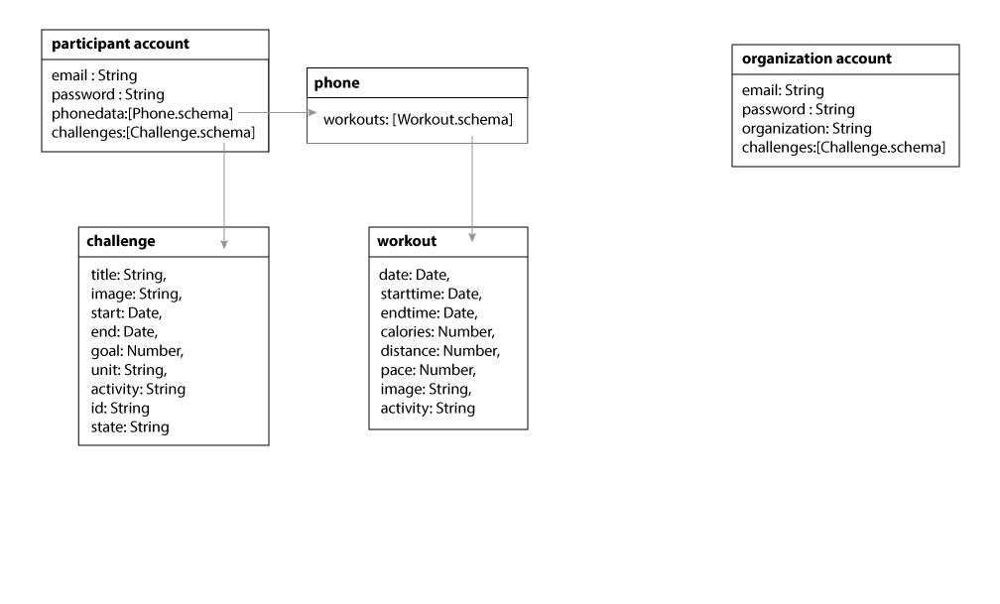

# health-blockchain API

The API exposes this data model:

   

## User Session

Implemented in [routes/users.js](./routes/users.js)

| Method | Path | Description |
| ------ | ---- | ----------- |
| POST   | /api/users/signup | new user
| POST   | /api/users/login | log in
| GET    | /api/users/isLoggedIn | return user info if logged in
| POST   | /api/users/logout | log out

During user registration, if an *organization* field is specified, the user will be able to submit challenges to the market.

Sample users ([seed/account.json](./seed/account.json)) are injected during startup if the *account* database is empty:
* one standard user with email **john@acme.com** and password set to **password**
* one *organization* user with email **jim@insurance.com** and password set to **password**

## Challenge Market used by organization

Implemented in [routes/market.js](./routes/market.js)

All users can retrieve the list of challenges submitted by an organization. When a user is part of an organization, she can add/edit/remove challenges for her organization.

| Method | Path | Description |
| ------ | ---- | ----------- |
| GET    | /api/market/challenges | view available challenges
| GET    | /api/organization/challenges | view challenges owned by the current organization
| POST   | /api/organization/challenges | allows an organization to submit a new challenge to the market
| DELETE | /api/organization/challenges/:id | allows an organization to delete its challenge from the market
| PUT    | /api/organization/challenges/:id | allows an organization to update its challenge
| GET    | /api/organization/challenges/:id | view a challenge
| GET    | /api/organization/challenges/:id/summary | view a challenge summary including participants, related workouts

Sample challenges ([seed/market.json](./seed/market.json)) linked to the sample accounts are injected during startup if the *market* database is empty.

## User Challenges

Implemented in [routes/account/challenges.js](./routes/account/challenges.js)

| Method | Path | Description |
| ------ | ---- | ----------- |
| GET    | /api/account/challenges | view user challenges
| GET    | /api/account/challenges/summary | a summary of the user challenges
| POST   | /api/account/challenges/accept/:marketChallengeId | subscribe to a challenge found in the market

Sample challenges ([seed/challenges.json](./seed/challenges.json)) linked to the sample users are injected during startup if the *challenges* database is empty.

## User Workouts

Implemented in [routes/account/workouts.js](./routes/account/workouts.js)

| Method | Path | Description |
| ------ | ---- | ----------- |
| GET    | /api/account/workouts | view user workouts
| POST   | /api/account/workouts | add a user workout
| PUT    | /api/account/workouts/:id | update a user workout
| DELETE | /api/account/workouts/:id | delete a user workout

Sample workouts ([seed/workouts.json](./seed/workouts.json)) linked to the sample users and user challenges are injected during startup if the *workouts* database is empty.

## Internal access to the Blockchain data

Implemented in [routes/blockchain.js](./routes/blockchain.js)

| Method | Path | Description |
| ------ | ---- | ----------- |
| GET    | /api/private/blockchain/blocks | return recent blocks
